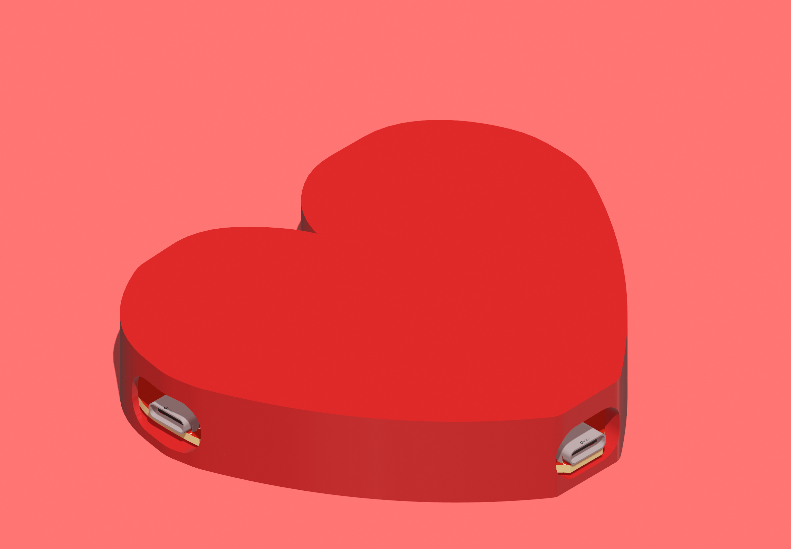
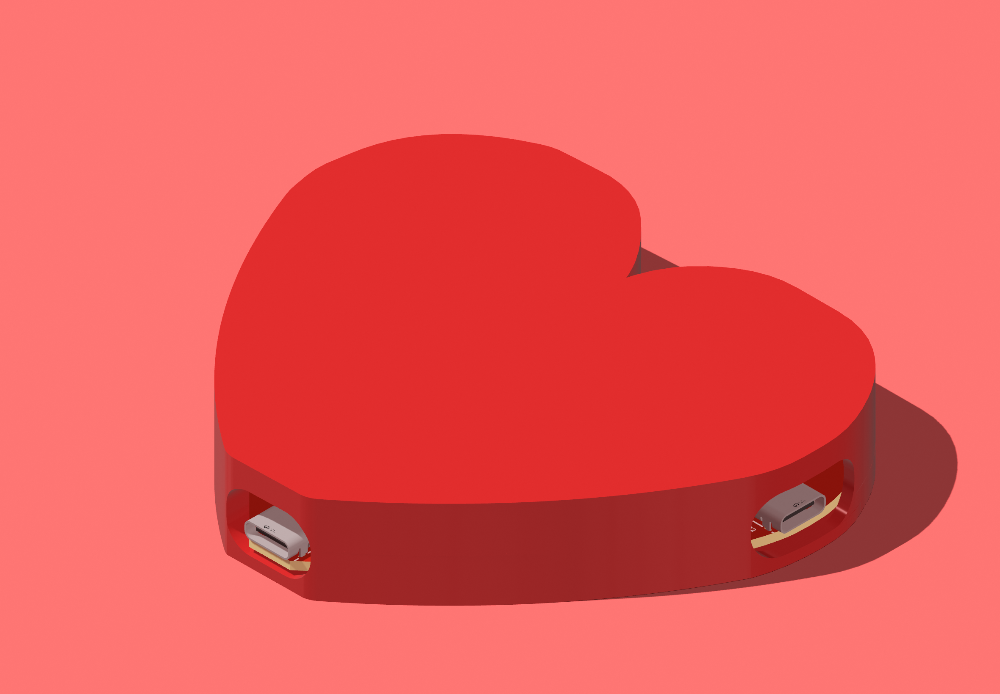
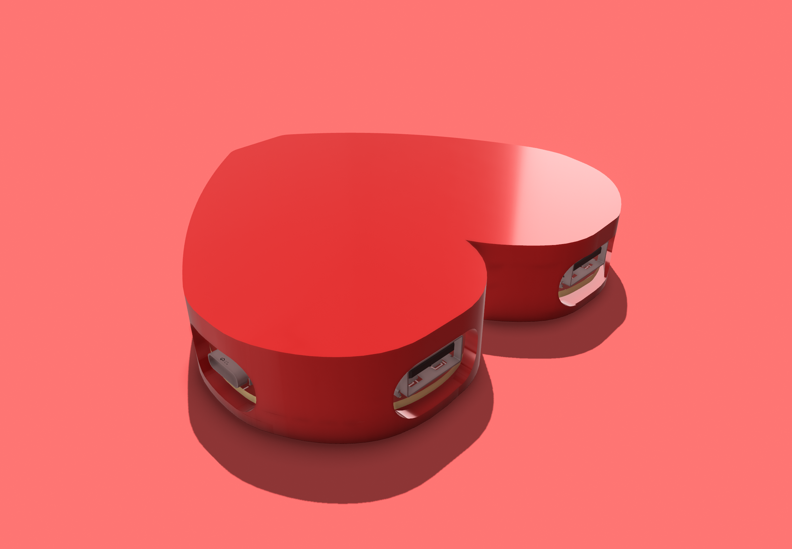
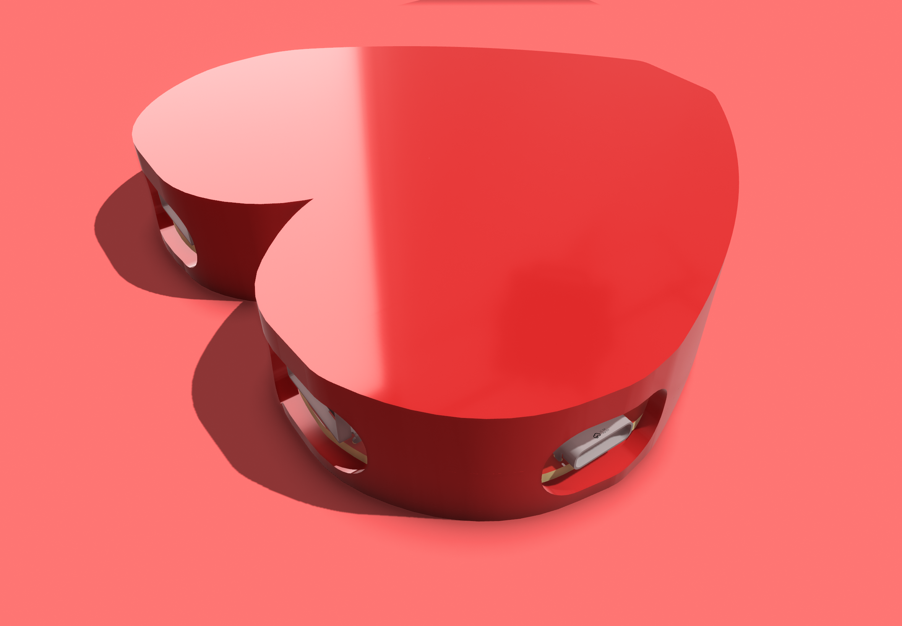
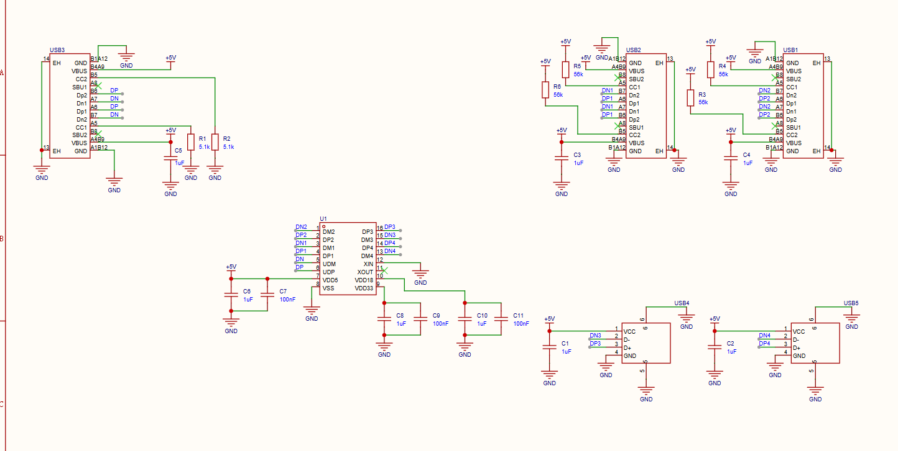
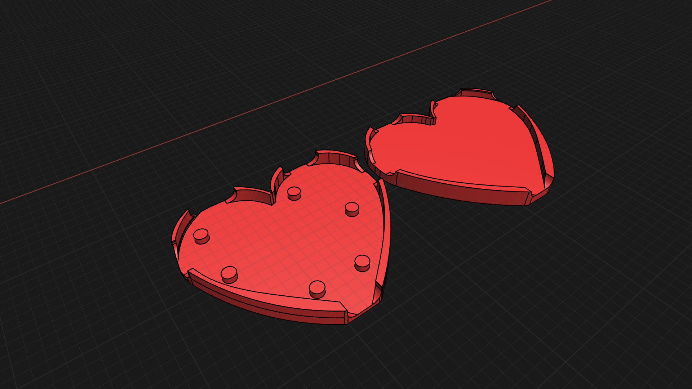

# USB HUB

   
  
  
  

This is a USB HUB i made following this [tutorial](https://macondo.hackclub.com/docs/usb-hub)

## Schematics

  

[pdf version](media/SCH_Schematic1_2026-07-20.pdf)

## PCB

  
  

## Case

  

The case is designed in Shapr 3d and is supposed to be glued together with super glue cause the PCB is really simple and we won't be needing to remove it from the case once inside so i guess super glue holding the case together is fine. The case is designed to be 3d printed and the high quality 3mf files are included in this repositary along with step design files as well!

## BOM

| Product Name                           | Quantity |   Price | Link                                                                          |
| -------------------------------------- | -------: | ------: | ----------------------------------------------------------------------------- |
| CL10A105KB8NNNC 1uF capacitor          |       40 | $3.4600 | [JLCPCB](https://jlcpcb.com/partdetail/16531-CL10A105KB8NNNC/C15849)          |
| CC0603KRX7R9BB104 100nF capacitor      |       15 | $0.4215 | [JLCPCB](https://jlcpcb.com/partdetail/YAGEO-CC0603KRX7R9BB104/C14663)        |
| 0603WAF5101T5E 5.1k resistor           |       10 | $0.0840 | [JLCPCB](https://jlcpcb.com/partdetail/23913-0603WAF5101T5E/C23186)           |
| 0603WAF5602T5E 56k resistor            |       20 | $0.2000 | [JLCPCB](https://jlcpcb.com/partdetail/23933-0603WAF5602T5E/C23206)           |
| SL2.1s USB hub controller              |        5 | $1.2515 | [JLCPCB](https://jlcpcb.com/partdetail/CoreChips-SL21s/C2684433)              |
| TYPE-C 16PIN 2MD(073) USB-C receptacle |       16 | $1.1760 | [JLCPCB](https://jlcpcb.com/partdetail/SHOUHAN-TYPE_C_16PIN_2MD_073/C2765186) |
| 10.0 QHHTZB6.3 USB-A receptacle        |       12 | $0.7932 | [JLCPCB](https://jlcpcb.com/partdetail/SHOUHAN-10_0_QHHTZB63/C668591)         |
| PCB FAB                                |        5 |      $2 | JLCPCB                                                                        |

| Total | | $9.3862 | |

> this excludes shipping costs which could be around $10-15 and could be charged separately for PCB and components.

## Project Files

- [USB HUB.eprj2](USB%20HUB.eprj2) is the project source file for EasyEDA Pro. It contains the schematics and PCB design files in it. You can open it in EasyEDA Pro to view and edit the design.
- [Gerbers](Production/Gerber_PCB1_2026-07-19.zip) are present in the Production folder. You can use them to order the PCB from any PCB manufacturer.
- [CAD Files](CAD/) contains the [fully assembled case design file](CAD/Usb%20hub%20assembled.step) and the [Bottom](CAD/Bottom%20Case.step) and [Top](CAD/Top%20Case.step) case design files in step format.
  - It also contains the 3mF printable files for the [Top](CAD/Top%20Case.3mf) and [Bottom](CAD/Bottom%20Case.3mf) case.
